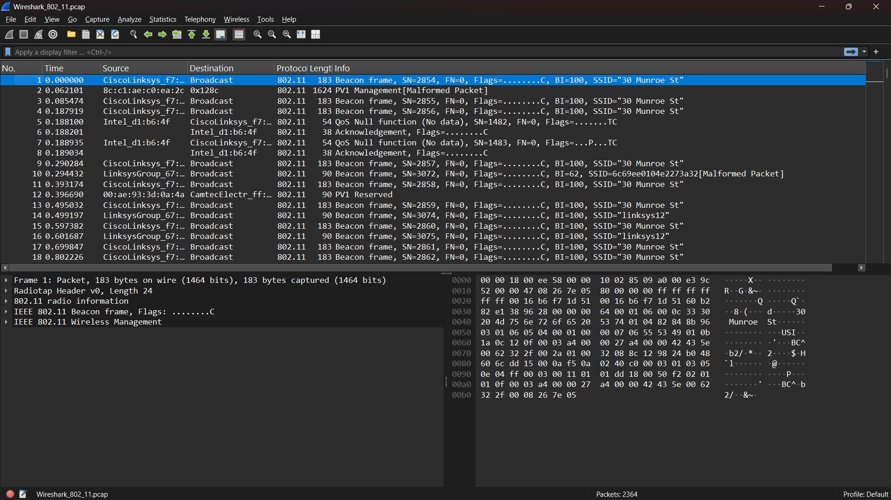
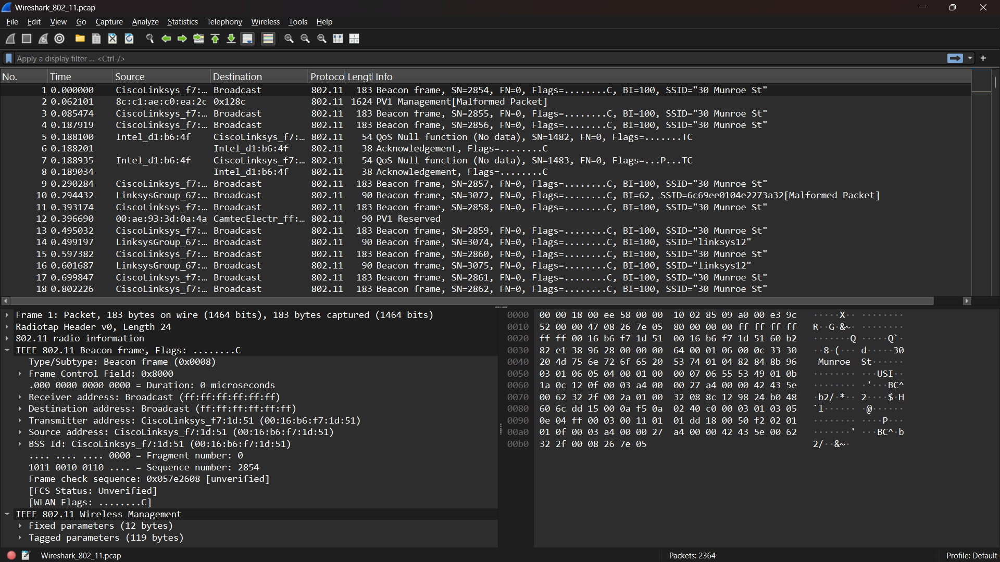
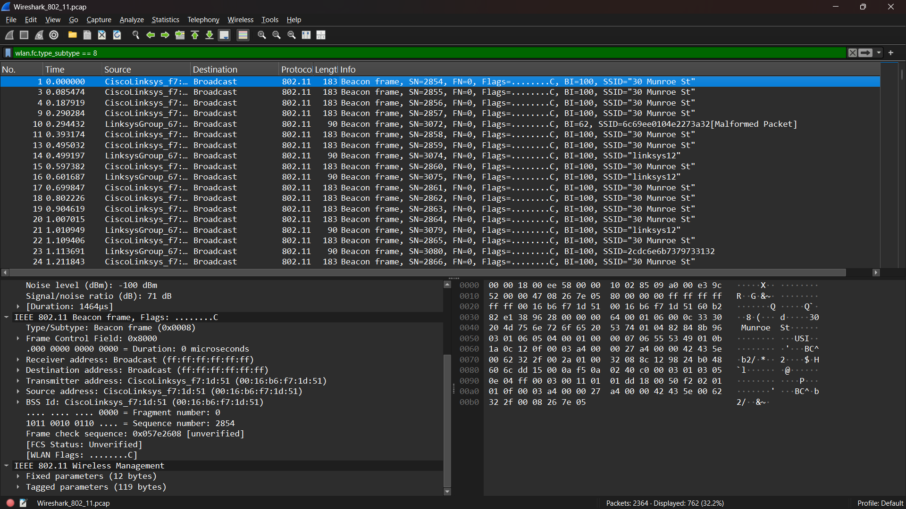
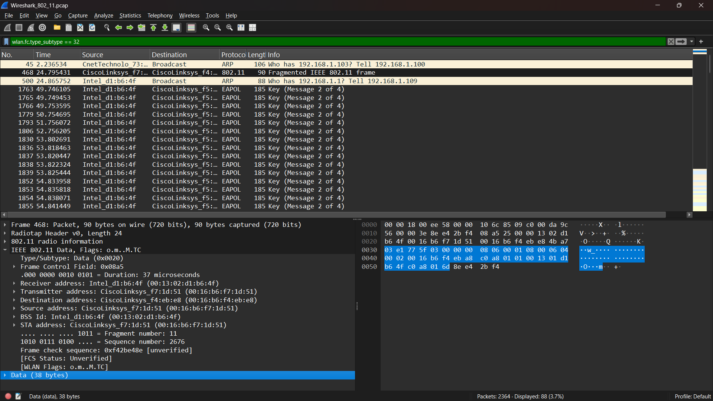

# Modul 14 – Protokol WiFi IEEE 802.11  

## Tujuan Praktikum  
1. Mahasiswa dapat menginvestigasi cara kerja WiFi menggunakan Wireshark.  
2. Mengenali struktur frame 802.11.  
3. Memahami fungsi Beacon Frame.  
4. Meninjau proses transfer data pada jaringan nirkabel.  
5. Menjelaskan asosiasi dan disasosiasi antara klien dan Access Point (AP).  

---

## 14.1 Pengantar  
Pada modul ini, kita menyelidiki protokol jaringan nirkabel IEEE 802.11. Frame ditangkap menggunakan **AirPcap** dan dianalisis dengan **Wireshark**. Karena tidak semua NIC mendukung penangkapan frame 802.11, file jejak sudah disediakan agar dapat dipelajari.  

---

## 14.2 Aktivitas Host dalam File Trace  
File **Wireshark_802_11.pcap** berisi rekaman aktivitas host nirkabel:  

- Host sudah terhubung dengan AP **30 Munroe St** saat perekaman dimulai.  
- Pada **t = 24,82**, host mengirim permintaan HTTP ke `http://gaia.cs.umass.edu/wiresharklabs/alice.txt` (IP tujuan **128.119.245.12**).  
- Pada **t = 32,82**, host mengakses `http://www.cs.umass.edu` (IP tujuan **128.119.240.19**).  
- Pada **t = 49,58**, host mencoba bergabung ke AP **linksys_ses_24086**, namun gagal karena AP tersebut tidak terbuka.  
- Pada **t = 63,0**, host kembali melakukan asosiasi dengan AP **30 Munroe St**.  

  
  

---

## 14.3 Beacon Frame  
Beacon Frame digunakan oleh AP untuk mengumumkan keberadaan jaringan dan memberikan informasi konfigurasi.  

Detail yang terlihat pada trace:  
- **SSID**: 30 Munroe St  
- **BSSID**: 00:16:b6:f7:1d:51  
- **Alamat Sumber**: 00:16:b6:f7:1d:51  
- **Alamat Tujuan**: ff:ff:ff:ff:ff:ff (broadcast)  
- **Beacon Interval**: 100 TU (Time Unit)  

  

---

## 14.4 Data Transfer  
Frame data membawa informasi aplikasi (HTTP, TCP, DNS, dll.) melalui jaringan WiFi. Pada trace, terlihat aktivitas transfer data saat host melakukan permintaan HTTP ke server **gaia.cs.umass.edu** dan **www.cs.umass.edu**.  

  

---

## 14.5 Association dan Disassociation  
- **Association Request**: dikirim oleh klien untuk bergabung dengan AP.  
- **Association Response**: balasan dari AP yang menentukan apakah klien diterima.  
- **Disassociation**: digunakan untuk memutuskan hubungan antara klien dan AP.  

Dalam file trace, tidak ditemukan frame **Disassociation**, sehingga dapat disimpulkan bahwa selama perekaman tidak terjadi pemutusan koneksi resmi antara host dan AP.  

  
  

---

## Kesimpulan  
Praktikum ini memperlihatkan bagaimana WiFi bekerja melalui frame 802.11. Beacon Frame berfungsi sebagai sinyal iklan jaringan, frame data membawa informasi aplikasi, dan proses asosiasi/disasosiasi mengatur hubungan antara klien dan AP. Analisis dengan Wireshark membantu memahami detail komunikasi nirkabel secara nyata.  
