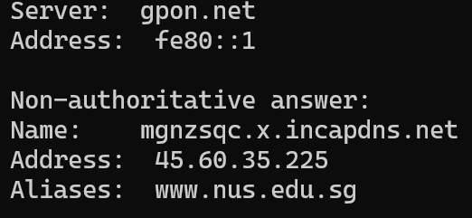
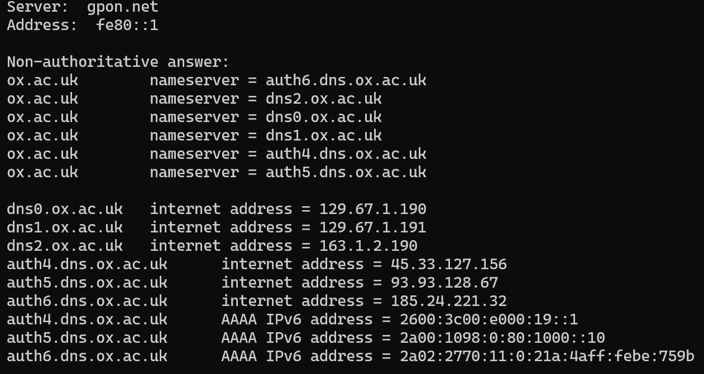
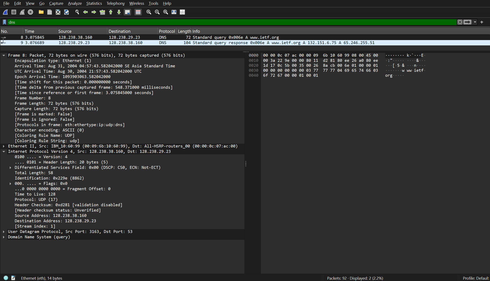
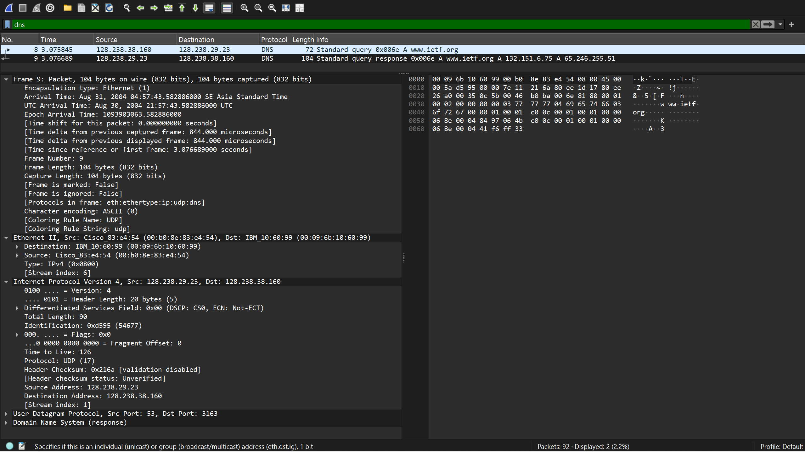
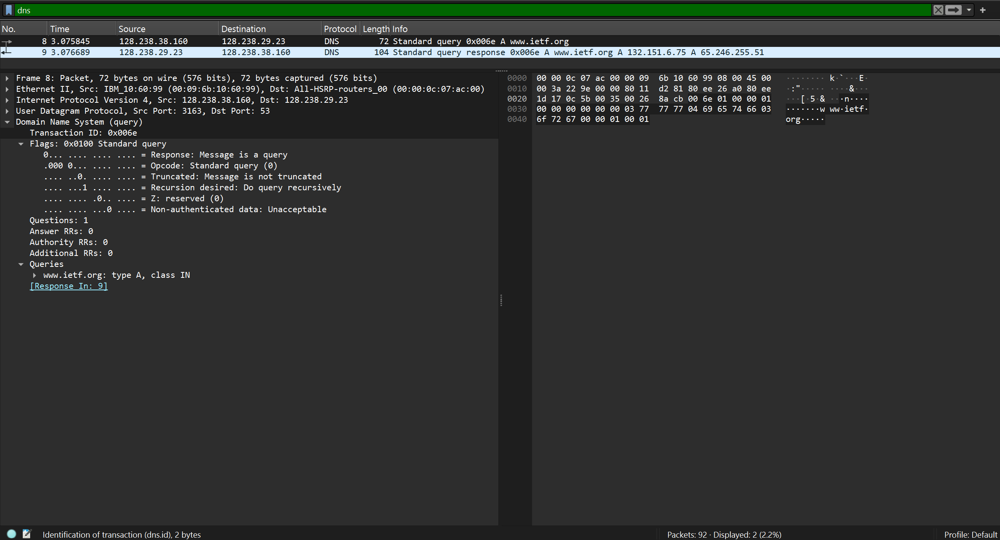
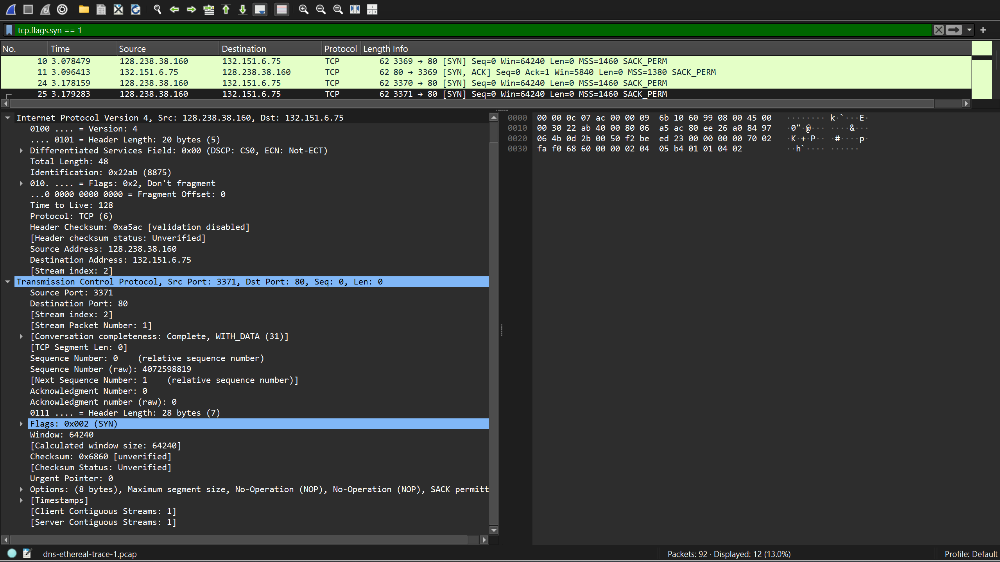
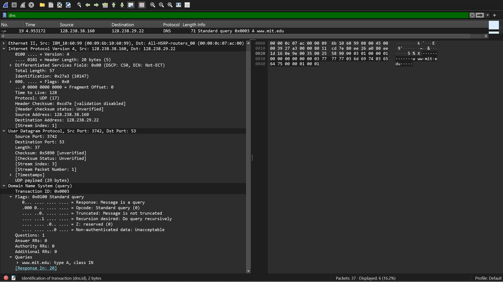
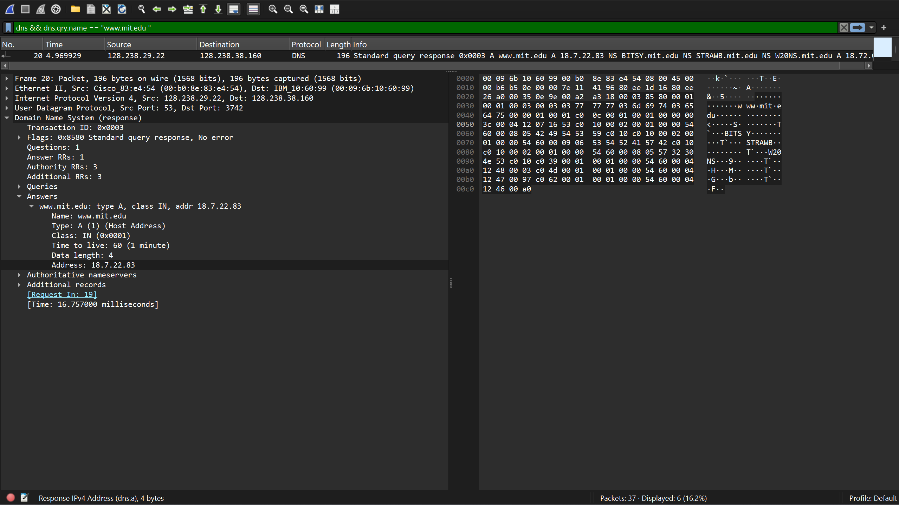
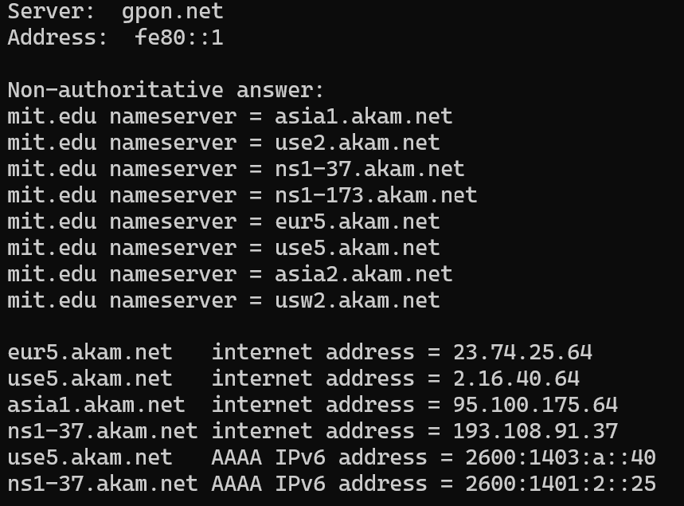

# 4.2 Nslookup

## Soal
1. Jalankan nslookup untuk mendapatkan alamat IP dari server web di Asia. Berapa alamat IP server tersebut?  
2. Jalankan nslookup agar dapat mengetahui server DNS otoritatif untuk universitas di Eropa.  
3. Jalankan nslookup untuk mencari tahu informasi mengenai server email dari Yahoo! Mail melalui salah satu server yang didapatkan di pertanyaan nomor 2. Apa alamat IP-nya?  

---

## Jawaban
1. **Alamat IP server web di Asia:**  
   `45.60.35.225`  

2. **Server DNS otoritatif Universitas Oxford (Eropa):**  
   - `auth6.dns.ox.ac.uk`  
   - `dns2.ox.ac.uk`  
   - `dns0.ox.ac.uk`  
   - `dns1.ox.ac.uk`  
   - `auth4.dns.ox.ac.uk`  
   - `auth5.dns.ox.ac.uk`  

3. **Alamat IP server email Yahoo! Mail (melalui salah satu server DNS di atas):**  
   `129.67.1.190`  

---

## Bukti
- **No 1:**   
- **No 2:**   
- **No 3:**   

# 4.4 Analisis DNS

## Bagian A – Soal 1–7

## Soal
1. Cari pesan permintaan DNS dan balasannya. Apakah pesan tersebut dikirimkan melalui UDP atau TCP?  
2. Apa port tujuan pada pesan permintaan DNS? Apa port sumber pada pesan balasannya?  
3. Pada pesan permintaan DNS, apa alamat IP tujuannya? Apa alamat IP server DNS lokal Anda (gunakan ipconfig untuk mencari tahu)? Apakah kedua alamat IP tersebut sama?  
4. Periksa pesan permintaan DNS. Apa “jenis” atau ”type” dari pesan tersebut? Apakah pesan permintaan tersebut mengandung ”jawaban” atau ”answers”?  
5. Periksa pesan balasan DNS. Berapa banyak ”jawaban” atau ”answers” yang terdapat di dalamnya? Apa saja isi yang terkandung dalam setiap jawaban tersebut?  
6. Perhatikan paket TCP SYN yang selanjutnya dikirimkan oleh host Anda. Apakah alamat IP pada paket tersebut sesuai dengan alamat IP yang tertera pada pesan balasan DNS?  
7. Halaman web yang sebelumnya Anda akses (http://www.ietf.org) memuat beberapa gambar. Apakah host Anda perlu mengirimkan pesan permintaan DNS baru setiap kali ingin mengakses suatu gambar?  

---

## Jawaban
1. **Protokol:** UDP  
2. **Port:**  
   - Tujuan request: `53`  
   - Sumber request: `3163`  
   - Sumber response: `53`  
3. **Alamat IP:** Sama (IP tujuan = IP server DNS lokal)  
4. **Type:** `A`  
   - Tidak ada *answers* pada request  
5. **Balasan:** 2 *answers*  
   - `www.ietf.org → 132.151.6.75`  
   - `www.ietf.org → 65.246.255.51`  
6. **Kesesuaian IP:** Ya, sesuai  
7. **Permintaan DNS baru:** Tidak  

---

## Bukti
- **Request:**   
- **Response:**   
- **Detail Type:**   
- **TCP SYN:**   

## Bagian B – Soal 1–5

## Soal
1. Apa port tujuan pada pesan permintaan DNS? Apa port sumber pada pesan balasan DNS?  
2. Ke alamat IP manakah pesan permintaan DNS dikirimkan? Apakah alamat IP tersebut merupakan default alamat IP server DNS lokal Anda?  
3. Periksa pesan permintaan DNS. Apa ”jenis” atau ”type” dari pesan tersebut? Apakah pesan tersebut mengandung ”jawaban” atau ”answers”?  
4. Periksa pesan balasan DNS. Berapa banyak ”jawaban” atau “answers” yang terdapat di dalamnya? Apa saja isi yang terkandung dalam setiap jawaban tersebut?  
5. Sertakan hasil tangkapan layar.  

---

## Jawaban
1. **Port:**  
   - Tujuan (request): `53`  
   - Sumber (response): `53`  

2. **Alamat IP:**  
   - Tujuan: `128.238.29.22`  
   - Sumber: `128.238.38.160`  
   - Keterangan: IP tujuan merupakan default server DNS lokal  

3. **Type:** `A`  
   - Tidak ada *answers* pada request  

4. **Balasan:**  
   - Jumlah *answers*: `1`  
   - Isi jawaban: alamat IP hasil resolusi untuk domain yang diminta  

---

## Bukti
- **Request:**   
- **Response:**   

## Bagian C – Soal 1–4

# 4.4 Analisis DNS – Bagian C (Soal 1–3)

## Soal
1. Ke alamat IP manakah pesan permintaan DNS dikirimkan? Apakah alamat IP tersebut merupakan default alamat IP server DNS lokal Anda?  
2. Periksa pesan permintaan DNS. Apa ”jenis” atau ”type” dari pesan tersebut? Apakah pesan tersebut mengandung ”jawaban” atau ”answers”?  
3. Periksa pesan balasan DNS. Apa nama server MIT yang diberikan oleh pesan balasan? Apakah pesan balasan ini juga memberikan alamat IP untuk server MIT tersebut?  
4. Sertakan hasil tangkapan layar.

---

## Jawaban
1. **Alamat IP tujuan request:**  
   - Request dikirim ke default DNS server: `gpon.net`  
   - IP server DNS lokal: `fe80::1`  
   - **Kesimpulan:** Ya, request dikirim ke default DNS server lokal  

2. **Jenis query:**  
   - Type: `NS`  
   - Request tidak mengandung *answers*  

3. **Isi balasan DNS:**  
   - Nama server MIT (Authority / nameservers):  
     - `asia1.akam.net`  
     - `use2.akam.net`  
     - `ns1-37.akam.net`  
     - `ns1-173.akam.net`  
     - `eur5.akam.net`  
     - `use5.akam.net`  
     - `asia2.akam.net`  
     - `usw2.akam.net`  
   - Balasan juga memberikan alamat IP beberapa server MIT:  
     - `eur5.akam.net → 23.74.25.64`  
     - `use5.akam.net → 2.16.40.64`  
     - `asia1.akam.net → 95.100.175.64`  
     - `ns1-37.akam.net → 193.108.91.37`  
   - Beberapa juga ada IPv6:  
     - `use5.akam.net → 2600:1403:a::40`  
     - `ns1-37.akam.net → 2600:1401:2::25`  

---

## Bukti
- **Response:**   

## Bagian D – Soal 1–4

## Soal
1. Ke alamat IP manakah pesan permintaan DNS dikirimkan? Apakah alamat IP tersebut merupakan default alamat IP server DNS lokal Anda?  
2. Periksa pesan permintaan DNS. Apa ”jenis” atau ”type” dari pesan tersebut? Apakah pesan tersebut mengandung ”jawaban” atau ”answers”?  
3. Periksa pesan balasan DNS. Berapa banyak ”jawaban” atau “answers” yang terdapat di dalamnya? Apa saja isi yang terkandung dalam setiap jawaban tersebut?  
4. Sertakan hasil tangkapan layar.  

---

## Jawaban
1. **Alamat IP tujuan request:**  
   - Tujuan: `bitsy.mit.edu → 18.0.72.3`  
   - Bukan default server DNS lokal  

2. **Jenis query:**  
   - Type: `A`  
   - Request tidak mendapat jawaban (*answers* kosong)  

3. **Isi balasan DNS:**  
   - Tidak ada jawaban sama sekali, karena *timeout*  

---

## Bukti
- **Response:**   