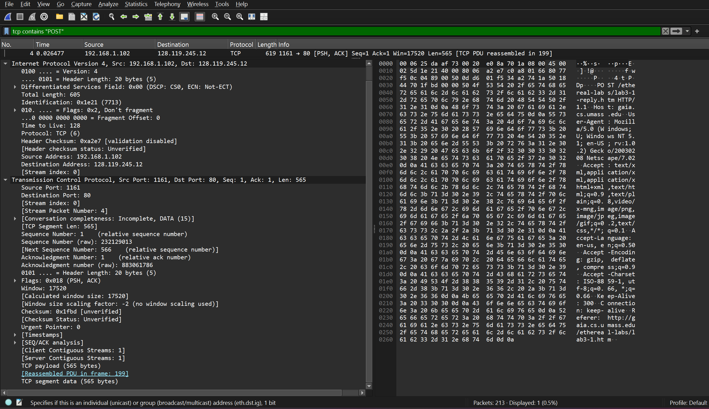
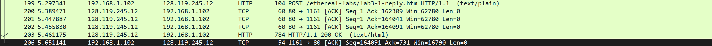
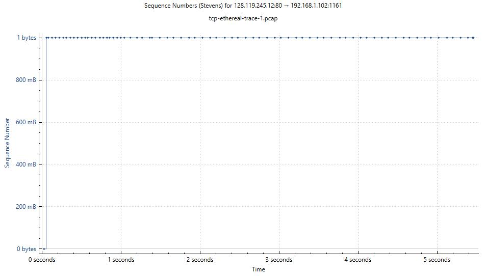

# TCP Analysis Using Wireshark

## Bagian A – Soal 1–3

## Soal
1. Berapa alamat IP dan nomor port TCP yang digunakan oleh komputer klien (sumber) untuk mentransfer file ke gaia.cs.umass.edu? Cara paling mudah menjawab pertanyaan ini adalah dengan memilih sebuah pesan HTTP dan meneliti detail paket TCP yang digunakan untuk membawa pesan HTTP tersebut.
2. Apa alamat IP dari gaia.cs.umass.edu? Pada nomor port berapa ia mengirim dan menerima segmen TCP untuk koneksi ini?
3. Berapa alamat IP dan nomor port TCP yang digunakan oleh komputer klien Anda (sumber) untuk mentransfer ke gaia.cs.umass.edu?

---

## Jawaban
1. IP Klien: 192.168.1.102  
   Port TCP Klien: 1161  

2. IP Server: 128.119.245.12  
   Port TCP Server: 80  

3. IP Klien: 192.168.1.102  
   Port TCP Klien: 1161  

---

## Bukti
- **POST:**   

## Bagian B – Soal 1–9

## Soal 
1. Berapa nomor urut segmen TCP SYN yang digunakan untuk memulai sambungan TCP antara komputer klien dan gaia.cs.umass.edu? Apa yang dimiliki segmen tersebut sehingga teridentifikasi sebagai segmen SYN?
2. Berapa nomor urut segmen SYNACK yang dikirim oleh gaia.cs.umass.edu ke komputer klien sebagai balasan dari SYN? Berapa nilai dari field Acknowledgement pada segmen SYNACK? Bagaimana gaia.cs.umass.edu menentukan nilai tersebut? Apa yang dimiliki oleh segmen sehingga teridentifikasi sebagai segmen SYNACK?
3. Berapa nomor urut segmen TCP yang berisi perintah HTTP POST? Perhatikan bahwa untuk menemukan perintah POST, Anda harus menelusuri content field milik paket di bagian bawah jendela Wireshark, kemudian cari segmen yang berisi "POST" di bagian field DATA nya.
4. Anggap segmen TCP yang berisi HTTP POST sebagai segmen pertama dalam koneksi TCP. Berapa nomor urut dari enam segmen pertama dalam TCP (termasuk segmen yang berisi HTTP POST)? Pada jam berapa setiap segmen dikirim? Kapan ACK untuk setiap segmen diterima? Dengan adanya perbedaan antara kapan setiap segmen TCP dikirim dan kapan acknowledgement-nya diterima, berapakah nilai RTT untuk keenam segmen tersebut? Berapa nilai EstimatedRTT setelah penerimaan setiap ACK? (Catatan: Wireshark memiliki fitur yang memungkinkan Anda untuk memplot RTT untuk setiap segmen TCP yang dikirim. Pilih segmen TCP yang dikirim dari klien ke server gaia.cs.umass.edu pada jendela "daftar paket yang ditangkap". Kemudian pilih: Statistics->TCP Stream Graph- >Round Trip Time Graph).
5. Berapa panjang setiap enam segmen TCP pertama?
6. Berapa jumlah minimum ruang buffer tersedia yang disarankan kepada penerima dan diterima untuk seluruh trace? Apakah kurangnya ruang buffer penerima pernah menghambat pengiriman?
7. Apakah ada segmen yang ditransmisikan ulang dalam file trace? Apa yang anda periksa (di dalam file trace) untuk menjawab pertanyaan ini?
8. Berapa banyak data yang biasanya diakui oleh penerima dalam ACK? Dapatkah anda mengidentifikasi kasus-kasus di mana penerima melakukan ACK untuk setiap segmen yang diterima?
9. Berapa throughput (byte yang ditransfer per satuan waktu) untuk sambungan TCP? Jelaskan bagaimana Anda menghitung nilai ini.

---

## Jawaban

1. Sequence Number (Client → Server)  
   - Biasanya 0 (relative)  
   - Ciri SYN: **SYN = 1**, **ACK = 0**

2. Sequence Number (Server → Client)  
   - Biasanya 0 (relative dari server)  
   - Ack number: `client_seq + 1`  
   - Cara menentukan: server ambil seq SYN client lalu tambah 1  
   - Ciri: **SYN = 1**, **ACK = 1**

3. Sequence Number  
   - Sequence Number (relative): 1  
   - Raw Sequence Number: 232129013

4. Segmen & RTT  
   - **Segmen pertama (Frame 199, HTTP POST)**  
     - Seq relatif: 164041  
     - Ack relatif: 1  
     - Waktu kirim: 5.297341 detik  
     - ACK diterima di Frame 201 pada 5.447887 detik  
     - RTT ≈ 0.150 detik  

   - **Segmen kedua (Frame 200)**  
     - Seq relatif: 1  
     - Ack relatif: 232291321  
     - Waktu kirim: 5.389471 detik  

   - **Segmen ketiga (Frame 201)**  
     - Seq relatif: 1  
     - Ack relatif: 164041  
     - Waktu kirim: 5.447887 detik  

   - **Segmen keempat (Frame 202)**  
     - Seq relatif: 1  
     - Ack relatif: 164091  
     - Waktu kirim: 5.455830 detik  

   - **Segmen kelima (Frame 203)**  
     - Seq relatif: 1  
     - Ack relatif: 164091  
     - Waktu kirim: 5.461175 detik  

   - **Segmen keenam (Frame 206)**  
     - Seq relatif: 164091  
     - Ack relatif: 731  
     - Waktu kirim: 5.651141 detik  

   > RTT untuk segmen selain pertama dihitung dengan cara sama: selisih waktu pengiriman dan waktu ACK diterima.  
   > Estimated RTT dapat dilihat di Wireshark melalui **Statistics → TCP Stream Graph → Round Trip Time Graph**.  
   > Semua sequence dan acknowledgment menggunakan relative numbers.

5. Panjang Segmen  
   - Segmen 199 (POST): 104 bytes  
   - Segmen 200: 60 bytes  
   - Segmen 201: 60 bytes  
   - Segmen 202: 60 bytes  
   - Segmen 203: 784 bytes  
   - Segmen 206: 54 bytes  

   > Panjang tiap segmen dapat dilihat di Wireshark pada kolom **Length** atau field **TCP segment length**.

6. Window Size  
   - Nilai minimum window size: lihat field **Window size value** di TCP header  
   - Berdasarkan trace, window tidak pernah 0 → tidak ada hambatan karena buffer

7. Retransmission  
   - Tidak ada segmen retransmission  
   - Dicek dengan filter `tcp.analysis.retransmission` → kosong  
   - Dari sequence number, tidak ada segmen yang muncul lebih dari sekali sebelum ACK diterima

8. Data yang diakui oleh penerima (ACK)  
   - Biasanya penerima mengakui seluruh data yang diterima sampai saat itu.  
   - Dari trace, sebagian besar ACK mengakui panjang segmen yang dikirim (misal 60 byte → ACK naik 60).  
   - Dalam beberapa kasus, ACK bisa mengakui beberapa segmen sekaligus jika segmen sebelumnya sudah diterima.  
   - Dapat dilihat dari **Acknowledgment Number** di TCP header di Wireshark.  

9. Throughput TCP  
   - Throughput = total byte yang dikirim / total waktu koneksi.  
   - Contoh perhitungan dari trace:  
     - Total data: jumlah TCP segment length dari segmen POST + segmen lainnya  
       (104 + 60 + 60 + 60 + 784 + 54 = **1122 bytes**)  
     - Total waktu: selisih antara paket pertama dan terakhir  
       (5.651141 s − 5.297341 s ≈ **0.354 s**)  
     - Throughput ≈ 1122 / 0.354 ≈ **3168 bytes/s (~3.1 KB/s)**  
   - Bisa dicek juga di Wireshark: **Statistics → TCP Stream Graph → Throughput**

---

## Bukti
- **POST:** 
- **SYN:** 
- **SYNACK:** 
- **TCP:** 
- **Relative Sequence:** 

---

## Bagian C – Soal 1–2

--- 

## Soal

1. Gunakan alat plotting Time-Sequence-Graph (Stevens) untuk melihat grafik nomor urut berbanding waktu dari segmen yang dikirim oleh klien ke server gaia.cs.umass.edu. Dapatkah Anda mengidentifikasi di mana fase “slow start” TCP dimulai dan berakhir, dan pada bagian mana algoritma ”congestion avoidance” mengambil alih? Berikan komentar tentang bagaimana data yang diukur berbeda dari perilaku ideal TCP yang telah kita pelajari. 
2. Jawablah kedua pertanyaan di atas untuk trace yang Anda dapatkan ketika Anda mengirimkan file dari komputer ke gaia.cs.umass.edu.

## Jawaban

1. Time-Sequence-Graph (Stevens)
- **Slow start** dimulai pada awal koneksi, ketika TCP mengirim data dengan jendela kecil dan meningkat cepat secara eksponensial. Pada grafik Stevens, hal ini tampak dari kenaikan sequence number yang tajam dalam waktu singkat.  
- **Akhir slow start** terjadi saat TCP mencapai nilai threshold (*ssthresh*) atau mendeteksi tanda kongesti. Setelah itu, laju pertambahan sequence number tidak lagi eksponensial.  
- **Congestion avoidance** kemudian mengambil alih, ditandai dengan kenaikan sequence number yang lebih landai dan linear karena TCP menambah ukuran jendela secara bertahap (*additive increase*).  
- **Perbedaan dengan perilaku ideal TCP**: dalam teori, kurva slow start eksponensial sempurna lalu berganti ke linear. Namun pada trace nyata, grafik menunjukkan variasi akibat kondisi jaringan, RTT, dan implementasi TCP. Misalnya, ada paket yang dikirim back-to-back (titik menumpuk), jeda antar segmen, atau fluktuasi yang membuat kurva tidak sehalus model teoritis.
2. Sudah 

---

## Bukti
- **Time-Sequence-Graph:**   